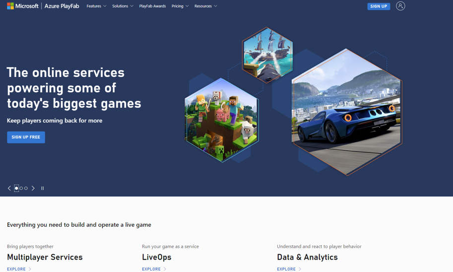
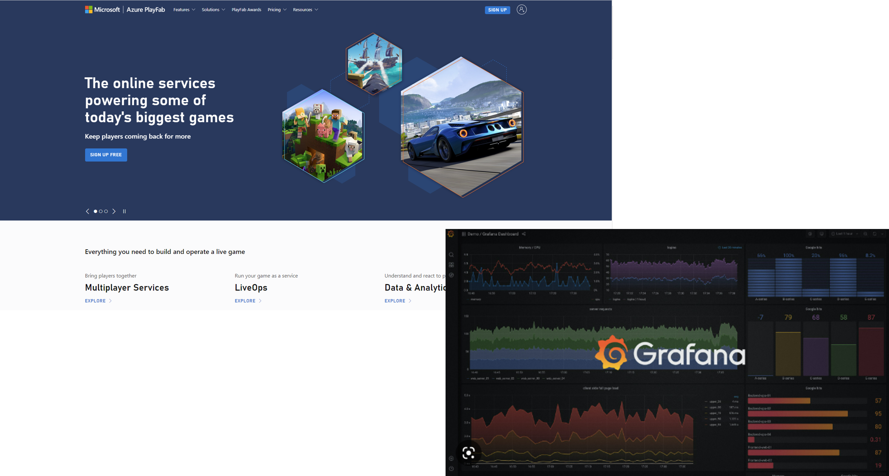
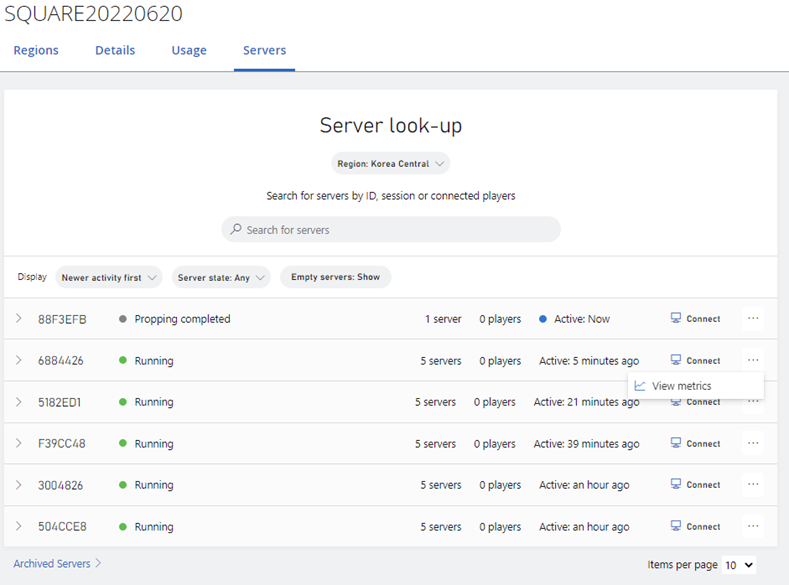
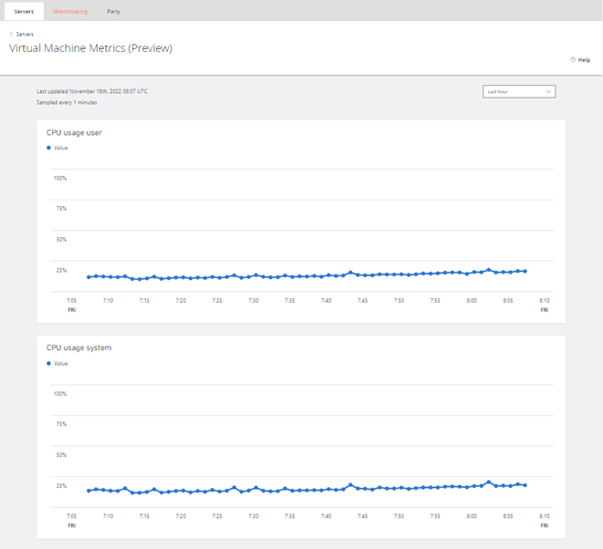
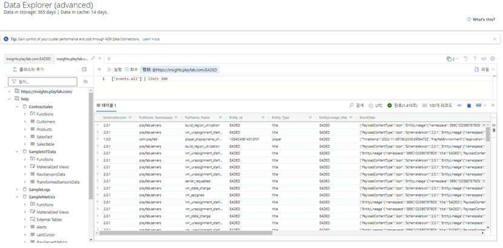

안녕하세요. 클라우드메이트 조한준입니다.

Azure PlayFab을 사용하고 있는 게임 서비스 업체와의 미팅 후, Azure PlayFab에 대하여 찾아보았습니다.

## Azure PlayFab이란?

아시는 분은 아시겠지만, Azure PlayFab은 라이브 게임의 빌드와 운영을 위한 종합적인 LiveOps 백 엔드 플랫폼이라고 정의할 수 있을 텐데요.
PlayFab의 백 엔드 서비스는 게임과 함께 확장되고 플레이어의 참여, 유지, 수익 창출에 도움이 되는 비용 효율적인 개발 솔루션인 스튜디오를 제공하여 게임 개발자의 진입 장벽을 낮출 수 있다고 하며
또한, 개발자가 인텔리전트 클라우드를 사용하여 게임을 빌드 및 운영하고, 게임 데이터를 분석하고, 전반적인 게임 환경을 개선할 수 있다고도 합니다.
게임 개발 및 운영에 있어서 클라우드를 효율적으로 활용할 수 있는 플랫폼인 것은 확실하다고 할 수 있을 거 같네요.

**미팅에서 도출된 고객의 요구 사항은 “Azure 리소스, PlayFab 리소스에 대한 대시보드 구성 / 모니터링 / 관제를 해줄 수 있나?”라는 내용이었습니다.**

그래서 다음과 같이 고려해 보았습니다.

* metric 수집 : Azure Monitor Or Azure Data Explorer
* 대시보드 구성, 모니터링 : Grafana 이용
* 관제 : 회사 NOC 솔루션 이용

추가적으로 BaaS 형태인 Azure PlayFab에서 서비스 이용자에게 제공하는 데이터 중에서 VM의 비정상 상태를 나타내는 이벤트와 데이터를 어떻게 수집할 수 있을까에 대하여 고민을 하게 되었습니다.
Azure PlayFab 공식 문서들을 보던 중, VM metrics 항목이라는 Article이 존재합니다.

https://learn.microsoft.com/en-us/gaming/playfab/features/multiplayer/servers/vm-metrics

system level metrics (CPU/RAM/etc.) for the Virtual Machines을 제공한다고 되어 있긴 합니다만, 웹 서비스 형태로 보여주기만 하는 것 같습니다. 
그리고 현재, 미리보기 상태이며 실험적이라고 되어 있네요. 난감한 상황입니다.

그래서, 단일 게임 타이틀에 대한 모든 이벤트와 데이터들을 저장하고 있는 데이터베이스를 사용하기로 하였습니다. 
Azure PlayFab 은 단일 게임 타이틀에 대한 모든 이벤트 및 처리된 데이터를 클라우드의 단일 타이틀 데이터베이스로 수집합니다. 
Azure Managed Grafana에서는 수집된 data들을 Azure Data Explorer를 통하여 Access 할 수 있습니다. 
Azure PlayFab 웹 서비스에서는 Data들을 다음과 같이 Kusto Query(KQL)를 통하여 Viewing 할 수 있습니다.

Data를 확인하며, 모니터링에 활용할 수 있는 VM 이벤트들을 조사해 보기로 합니다.
조사해본 결과, 'playfab.servers'의 'vm_unhealthy' 이벤트를 찾을 수 있었습니다.

Json 포맷 데이터를 예시로 들자면 아래와 같습니다.

<pre>
<code>
{
"EntityLineage":{
"namespace":"3B9C1D25BE7879D5",
"title":"EADED"
},
"Timestamp":"2022-09-13T14:03:40.2573414Z",
"PayloadContentType":"Json",
"SchemaVersion":"2.0.1",
"Originator":{
"Type":"service",
"Id":"playfab"
},
"FullName":{
"Namespace":"playfab.servers",
"Name":"vm_unhealthy"
},
"Payload":{
"BuildId":"50de9471-a984-42ba-b67a-5927c1737e99",
"Region":"KoreaCentral",
"VmId":"xxxx:KoreaCentral:xxxxx_5463xxx2-3ff9-41ef-b2f0-898xxxxd9d8:984a9c2b-3506-4ae3-aef4-844c4c615680",
"HealthStatus":"NoServerHeartbeat"
},
"Id":"19c2f0f5903741c4b4ff632d303d9751",
"Entity":{
"Type":"title",
"Id":"xxxxx"
}
}
</code>
</pre>

그리고, 아래와 같이 playfab.servers.vm_unhealthy 이벤트의 HealthStatus들을 찾을 수 있었습니다.

https://docs.microsoft.com/en-us/gaming/playfab/features/multiplayer/servers/multiplayer-build-region-lifecycle

각각의 HealthStatus에 대하여 기술해 봅니다.

* NoServerHeartbeat
    Azure Monitor Or Azure Data Explorer
* 대시보드 구성, 모니터링 : Grafana 이용
* 관제 : 회사 NOC 솔루션 이용

